<div align="center">


</div>

<div align="center">

# POC Monitoring and Observability with Prometheus and Grafana


</div> 

<div align="center">
</div>

## Fundamentos teóricos

> O Prometheus é um sistema de monitoramento e alerta de código aberto, desenvolvido originalmente pela equipe do SoundCloud. Ele foi projetado para coletar, armazenar e consultar métricas de sistemas distribuídos em tempo real.

> Grafana é uma plataforma de visualização de dados de código aberto, amplamente utilizada para criar painéis interativos e gráficos personalizados para dados de monitoramento.

> **Vantagens😆🧘👍🌈🌞**
```
1-Monitoramento abrangente: Prometheus e Grafana permitem monitorar uma ampla variedade de métricas e dados de desempenho em sistemas distribuídos, fornecendo informações valiosas sobre o estado do sistema, a utilização de recursos, a latência, entre outros.

2-Escalabilidade: Ambas as ferramentas foram projetadas para lidar com ambientes distribuídos e altamente escaláveis. Elas oferecem recursos para coletar e processar grandes volumes de dados de maneira eficiente.

3-Flexibilidade e personalização: Tanto o Prometheus quanto o Grafana são altamente configuráveis e permitem personalizar as configurações e visualizações para atender às necessidades específicas do ambiente e dos usuários.
```
## Tela do Prometheus
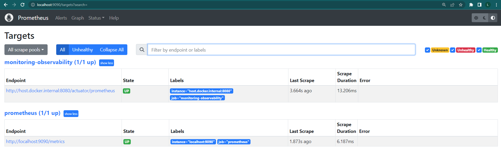

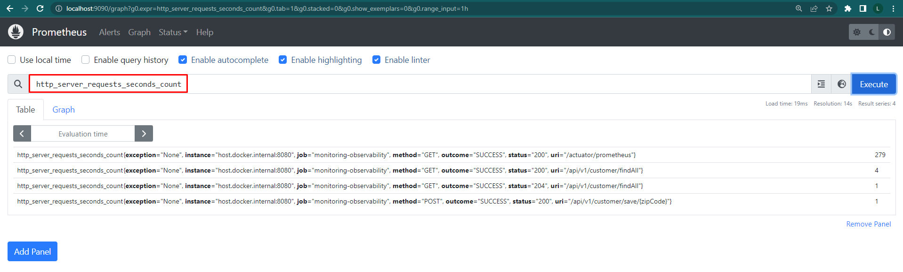

## Tela do Grafana
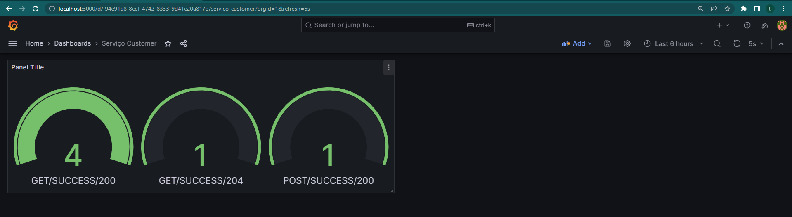

## Funcionalidades

| Métodos de requisição HTTP  | Descrição                       |
|-----------------------------|---------------------------------|
| `POST`                      | Inserir cliente                 |
| `GET`                       | Listar todos os clientes salvos |
| `GET`                       | Buscar cliente por Id           |
| `PUT`                       | Atualizar cliente               |
| `DELETE`                    | Deletar cliente                 |

##  Pré -requisitos

- [ `Java 19+` ](https://www.oracle.com/java/technologies/downloads/#java19)
- [ `Maven 3+` ](https://maven.apache.org/download.cgi)
- [ `Docker-Compose` ](https://docs.docker.com/compose/install/)
- [ `Docker` ](https://www.docker.com/)
    - Imagem Apache Kafka
    - Imagem Apache ZooKeeper
    - Imagem Prometheus
    - Imagem Grafana

## Tecnologias
- Java 19
- Apache Maven
- Apache ZooKeeper
- Apache Kafka
- Spring Boot 2.7.7
    - spring-boot-starter-web
    - spring-boot-starter-data-jpa
    - spring-boot-devtools
    - spring-cloud-starter-openfeign
    - spring-cloud-starter-sleuth
- Lombok
- H2
- Tomcat (Embedded no Spring Boot)
- Git
- Prometheus
- Grafana

## Portas
| Aplicação              | Porta |
|------------------------|-------|
| poc-prometheus-grafana | 8080  |
| kafka                  | 9092  |
| zookeeper              | 2181  |
| prometheus             | 9090  |
| grafana                | 3000  |

## Links

- Aplicação
    - http://localhost:8080
    - https://viacep.com.br/ws/{zipCode}/json/
    - http://localhost:9090/
    - http://localhost:3000/

>## Setup da aplicação

### Executando a aplicação com maven
- Na raiz do projeto execute o seguinte comando:
  ```shell
  ./mvnw clean package -DskipTests
  ```

### Gerando imagem docker
- Na raiz do projeto execute o seguinte comando para criar a imagem docker da aplicação:
  ```shell
  docker build --tag monitoring-observability .
  ```  

### Executar docker-compose para subir aplicação com container docker
- Dentro da pasta docker-compose, execute o seguinte comando para subir os containers:
  ```shell
  docker-compose up -d
  ```
- Execute o seguinte comando para verificar os status do containers docker:
  ```shell
  docker-compose ps
  ```

### Validar acesso e funcionamento do Prometheus
- Acesse o seguinte endereço para validar o funcionamento do Prometheus:
  ```shell
  http://localhost:9090/
  ```

### Validar acesso e funcionamento do Grafana
- Acesse o seguinte endereço para validar o funcionamento do Grafana:
  ```shell
  http://localhost:3000/
  ```
- usar as credenciais abaixo para acessar o Grafana:
  ```
  user: admin
  password: admin
  ```

### Method: POST
- URL: http://localhost:8080/api/v1/customer/save/{zipCode}
  #### Payload Request:
  ```json
  {
  "name": "Teste-01",
  "cpf": "001.002.003-04"
  }
  ```
### Method: GET
- URL: http://localhost:8080/api/v1/customer/findAll
### Method: GET
- URL: http://localhost:8080/api/v1/customer/find/{id}
### Method: PUT
- URL: http://localhost:8080/api/v1/customer/update/{id}
  #### Payload Request:
  ```json
  {
  "name": "Teste-02",
  "cpf": "001.002.003-04"
  }
  ```
### Method: DELETE
- URL: http://localhost:8080/api/v1/customer/delete/{id}

#
>## Configurar painel do Prometheus e Grafana
Acessar tela do Prometheus e verificar se a aplicação está sendo monitorada:


Acessar tela do Grafana realizar as configurações para iniciar o monitoramento da aplicação:
- Adminstração:
  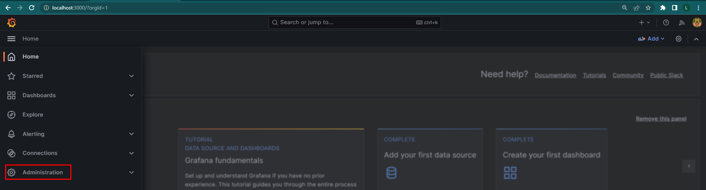
- Datasource:
  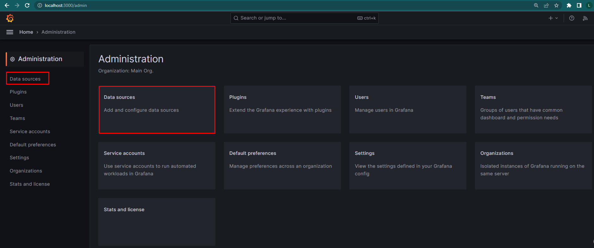
- Pesquisar datasource:
  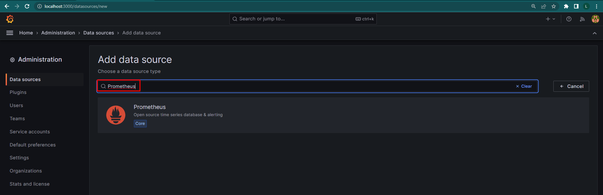
- Configuraração datasource:
    - Atenção apontar para o Prometheus url: http://prometheus:9090:
      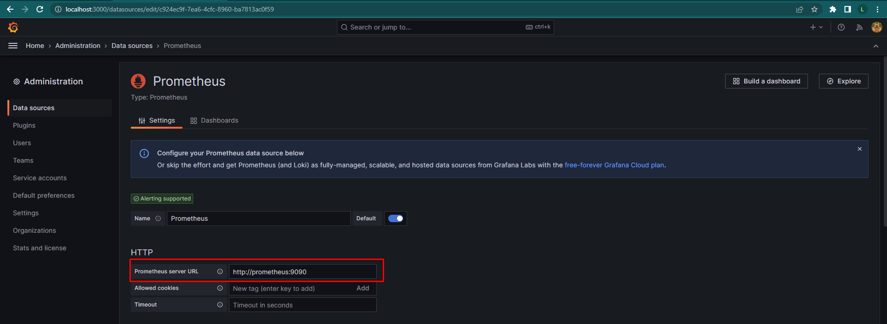
- Dashboards:
  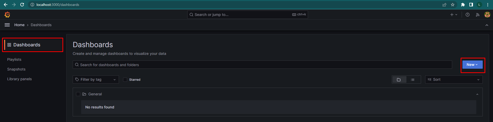
- Adicionar novo dashboard:
  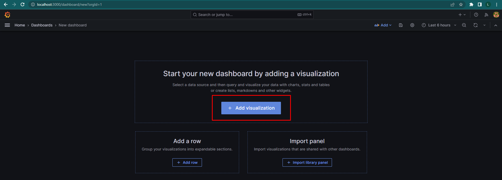
- Selecionar datasource:
  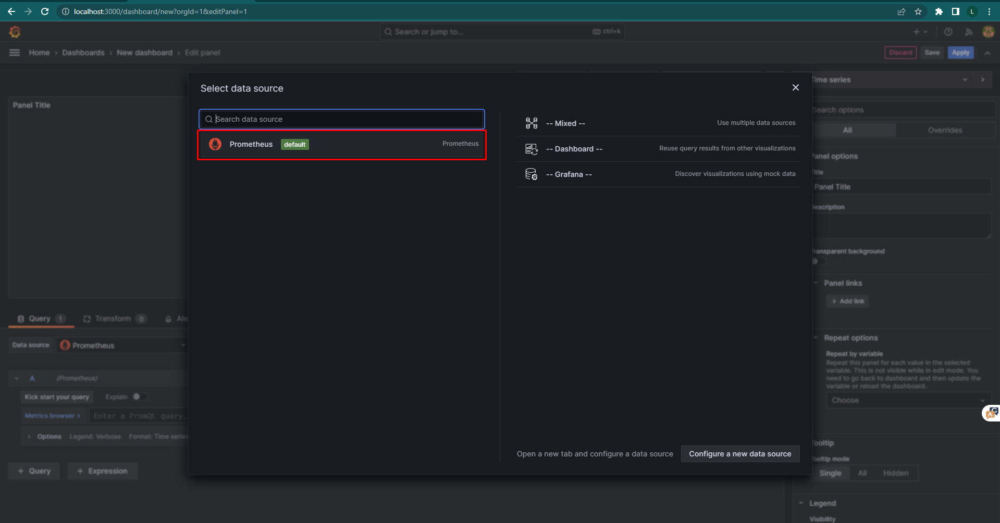
- Confirugar dashboard:
  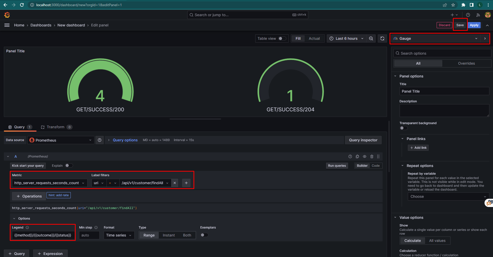

# Implementação para novo projeto

### Prometheus
- Adicionar dependência do Prometheus e Actuator no pom.xml:
  ```xml
  <dependency>
      <groupId>org.springframework.boot</groupId>
      <artifactId>spring-boot-starter-actuator</artifactId>
  </dependency>
  <dependency>
      <groupId>io.micrometer</groupId>
      <artifactId>micrometer-registry-prometheus</artifactId>
      <scope>runtime</scope>
  </dependency>
  ```

- Adicionar imagem do Prometheus no docker-compose.yml:
  ```yml
  prometheus:
    image: prom/prometheus
    container_name: prometheus
    networks:
      - app-network
    ports:
      - 9090:9090
    volumes:
      - ../prometheus.yml:/etc/prometheus/prometheus.yml # Raiz onde está o prometheus.yml
    command:
      - '--config.file=/etc/prometheus/prometheus.yml'
  ```

- Criar na raiz do projeto o arquivo prometheus.yml e adicionar configurações:
  ```yml
  global:
  scrape_interval: 15s
  external_labels:
  monitor: 'codelab-monitor'
  
  scrape_configs:
  - job_name: 'prometheus'
    scrape_interval: 5s
    static_configs:
    - targets: ['localhost:9090']
  
  - job_name: 'monitoring-observability'
    scrape_interval: 5s
    metrics_path: /actuator/prometheus
    static_configs:
    - targets: ['host.docker.internal:8080'] # host.docker.internal pega o ip da máquina host
  ```

- Adicionar configurações no application.properties:
  ```yml
  management:
    endpoints:
      web:
        exposure:
          include: info, health, prometheus, metrics
  ```

### Grafana
- Adicionar imagem do Grafana no docker-compose.yml:
  ```yml
  grafana:
    image: grafana/grafana
    container_name: grafana
    networks:
      - app-network
    ports:
      - 3000:3000
  ```
#
>## Desenvolvedores

**Leandro D'Souza**
- LinkedIn - www.linkedin.com/in/francis-leandro-de-souza
- GitHub - https://github.com/lsouzatj
